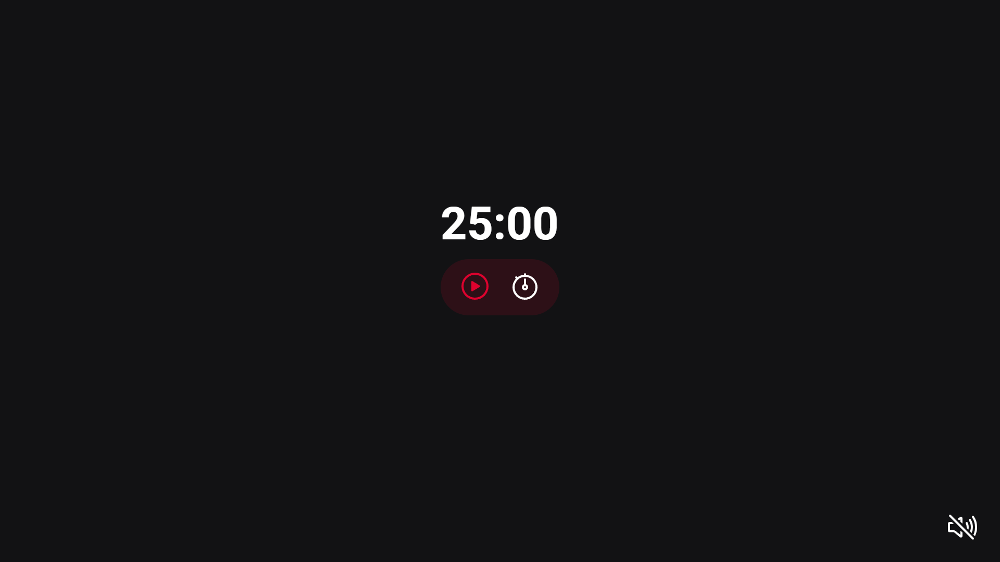

<h1 align="center"> Focus Timer </h1>

Exclusive and free program, promoted by Rocketseat for teaching WEB technologies.  

  <a href="#-technologies">Technologies</a>&nbsp;&nbsp;&nbsp;|&nbsp;&nbsp;&nbsp;
  <a href="#-project">Project</a>&nbsp;&nbsp;&nbsp;|&nbsp;&nbsp;&nbsp;
  <a href="#memo-license">License</a>

  

 

  

## 🚀 Technologies

This project was developed with the following technologies:

- HTML e CSS
- JavaScript
- Git and Github
- Figma

## 💻 Project

The Focus Timer is a pomodoro-style timer with time selection and ambient music.

- [Access the finished project online](https://adrielqueiroz2006.github.io/FocusTimer_Rocketseat/)

## :memo: License

This project is under the MIT license.
